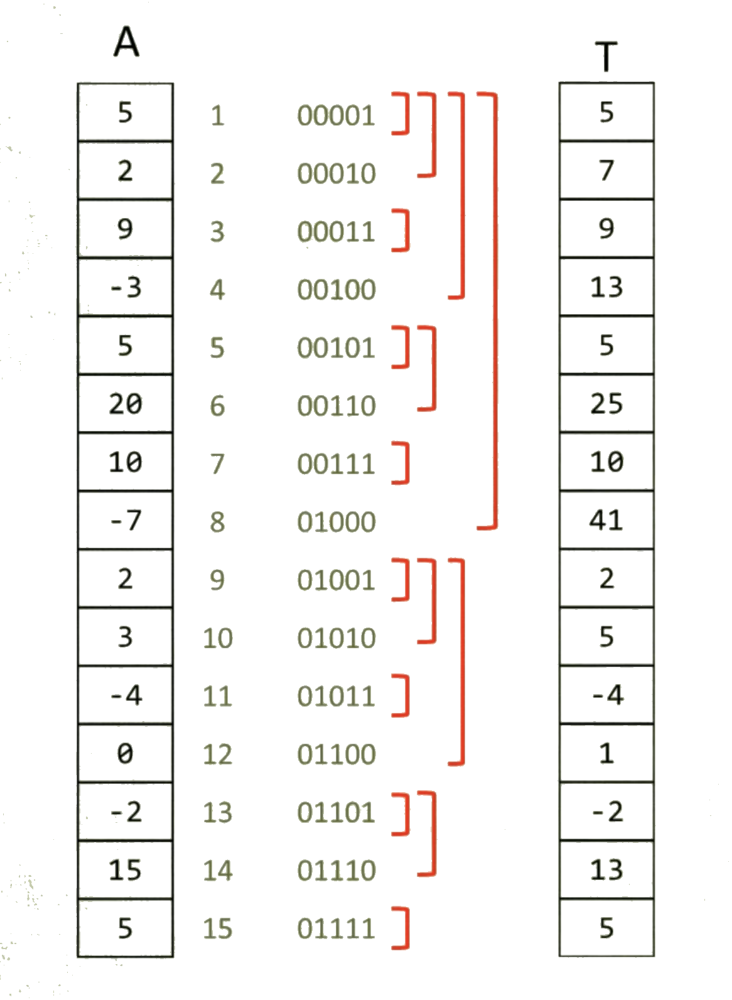

Fenwick Tree allows us to do range calculations without having to examine
every single number in the range. Suppose we want to sum up numbers in an 
array. A straightforward approach would be to loop over each element. This
takes O(n) operation.

This algorithm is called a fenwick tree, but we don't actually need a tree
nodes with pointers. Instead, it uses an additional array.

### How it is built

To create a fenwick tree, we have to get last set bit of an index.
If the bit is one, additional array wil just store a copy of a value from
the original array. If its the second rightmost bit, we sum up two values.
In case of third rightmost bit, we sum up four values, and so on.

### Query

For instance, to find the sum of numbers from index 1 to index 7, we need to 
convert 7 to binary, which is 00111. It has 3 bits that are set to 1. Thus,
the loop will run 3 times, adding values at index 00111 (7), 00110 (6) and
00100 (4).

Complexity of querying a sum of an index is O(log(n)).

### Update

Suppose we want to change the value of an element. We take the last bit set
for an index again. This time, instead of substracting, we add it to the index.

Comlplexity of updating an element is O(log(n)) as well.

### Delete & Insertion

Even though query and update is log(n) time, delete and insertion are more
expensive. Main purpose of a fenwick tree is to compute range operations and
update in log(n) time.
