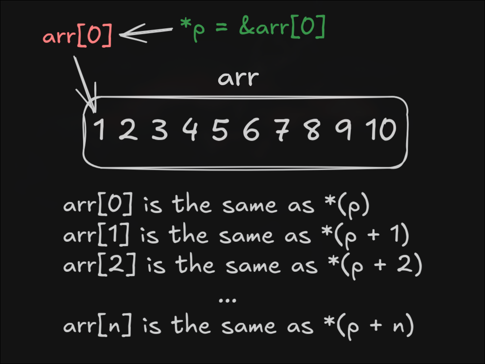

# Arrays

Arrat is just a collection of elements, and C has built-in support for it. When you declare an array, you have to give it a size. And the size has to be fixed.

Array is just an syntactic sugar in C - its all pointers under the hood. For instance:

```c
int arr[10];
int* p = &arr[0]; // Holds the address of the first element of arr
```
In essence, arr[0] and *p point to the same value. This is why arrays start with 0.



Writing [n] is just a syntactic sugar, which is the same as *(p + n).


# C-Strings

Strings aren’t actually strings in C. They’re pointers! 

String literals in C are sequences of characters in double quotes ("). Single quotes enclose characters, and are a different thing entirely. For example:

`char *s = "Hello, world!";`

Check out that type: pointer to a **char**. The string variable s is actually a pointer to the first character in that string, namely the _H_