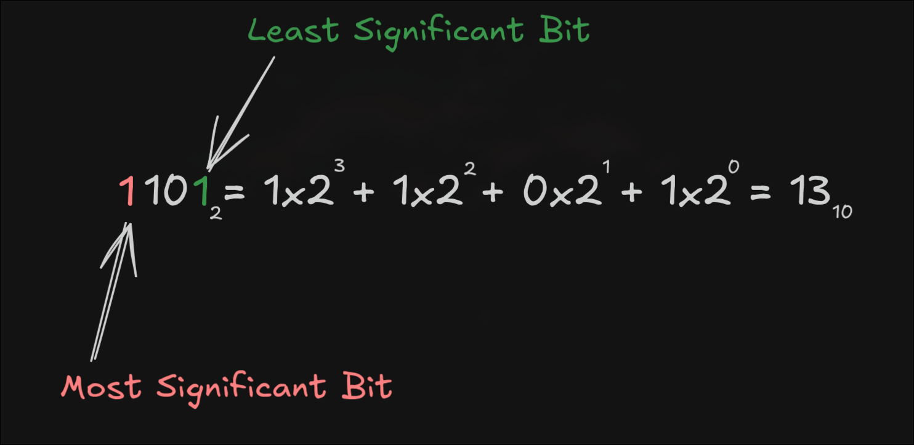
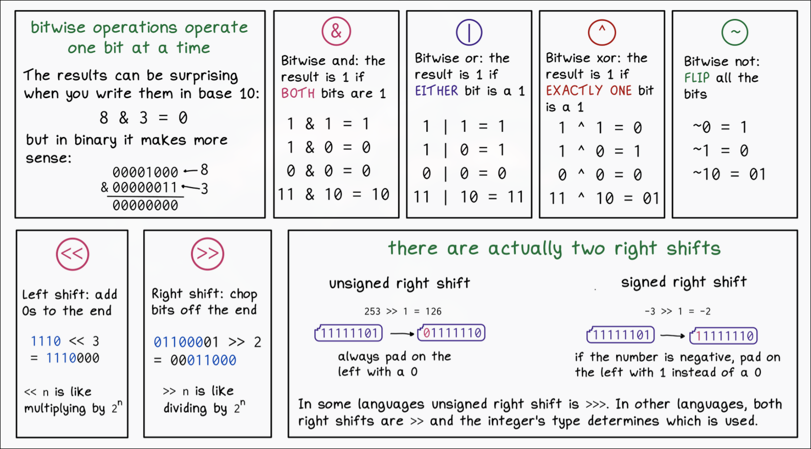

# Binary

The binary system is a way of representing data using 0s and 1s. This system is used by computers to represent all the data it works with. 

### Negative numbers

We can represent negative numbers in several ways. 

The simplest is to simply use the leftmost digit of the number as a special value to represent the sign of the number, this method is called _Signed Magnitude_. For example, a value of positive 12 (decimal) would be written as 01100 in binary, but negative 12 (decimal) would be written as 11100. Notice that in this system, it is important to show the leading 0 (to indicate a positive value).

Above approach requires special handling for arithmetics as we have 2 zeros - 1000 and 0000, therefore a different scheme, called "two's complement" is more often used for representing negative numbers.

#### Two's Complement

To get the two's complement negative notation of an integer, you write out the number in binary. You then invert the digits, and add one to the result.

Suppose we're working with 8 bit quantities (for simplicity's sake) and suppose we want to find how -28 would be expressed in two's complement notation. First we write out 28 in binary form.

`0 0 0 1 1 1 0 0`

Then we invert the digits. 0 becomes 1, 1 becomes 0.

`1 1 1 0 0 0 1 1`

Then we add 1.

`1 1 1 0 0 1 0 0`

That is how one would write -28 in 8 bit binary.

# Bitwise Operations

Bitwise Operators are similar to traditional Logical Operators in that they take two or more values and compare them to each other. The difference ultimately lies In what aspect of the value each operator type is comparing.

- ***AND (&)*** which looks at whether or not both bits in a similar position are 1, or “true”.
- ***OR (|)*** returns true if either bit is 1.
- ***XOR (^)*** returns true if only one of the compared bits are 1.
- ***and NOT (~)*** which inverts each value (admittedly I’m still not sure how exactly this one is used).

---
TODO:

- ASCII
- Arithmetics with two's comlpement
- Escape Sequences